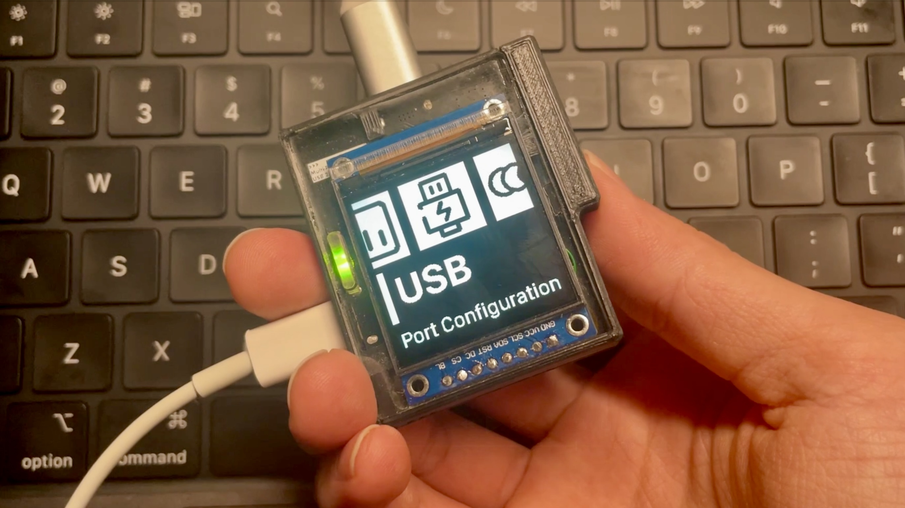

<h1 align="center">Vision UI</h1>

<a href="https://github.com/robcholz/vision-ui/actions">
<a href="https://github.com/robcholz/vision-ui">

     <a href="README.md">English</a> | <a href="README-zh-CN.md">简体中文</a>
  

<i>如果这个项目对你有帮助，欢迎点个 Star ⭐️</i>

Vision UI 是一个面向嵌入式显示设备的小型列表式 UI 框架。它提供菜单树、选择动画、滚动、通知、警告，以及一套驱动抽象层，使同一套 UI 逻辑既可以运行在桌面模拟器中，也可以运行在具体设备后端上。核心库本身与平台无关，只要实现绘制与输入驱动接口，就可以接入任意后端。

仓库中包含一个 simulator，作为其中一种后端示例，方便你在真正接入固件前先原型化菜单和全屏自定义场景。

## 特性

- 分层列表导航，支持标题行、开关、滑块、图标项以及用户自定义渲染场景。
- 选择器动画、摄像机跟随、文本滚动、进入/退出过渡、通知和警告。
- 精简的驱动接口，覆盖输入、文本测量、基础图元绘制、裁剪和缓冲区提交。
- 可通过 [`include/vision_ui_config.h`](include/vision_ui_config.h) 配置布局与时序常量，调优说明见 [`docs/config-zh-CN.md`](docs/config-zh-CN.md)。
- 平台无关的核心库，支持可插拔后端。
- 既可用于本地模拟，也可用于嵌入式目标平台。

## 示例

- [`docs/simulator-zh-CN.md`](examples/simulator/simulator-zh-CN.md)：如何构建并运行 SDL2 桌面模拟器。
- [`docs/esp32-zh-CN.md`](examples/esp32/esp32-zh-CN.md)：ESP32 集成示例说明。

## 文档

- [`docs/migration-zh-CN.md`](docs/migration-zh-CN.md)：如何把 `vision_ui_draw_driver.h` 迁移到新的后端。
- [`docs/api-zh-CN.md`](docs/api-zh-CN.md)：按使用任务分组的公开 API 中文参考。
- [`docs/config-zh-CN.md`](docs/config-zh-CN.md)：布局、间距和动画常量的配置说明。
- [`docs/project-layout-zh-CN.md`](docs/project-layout-zh-CN.md)：仓库结构与主要文件说明。

如果你想看一个完整的桌面端接入示例，可以直接参考 [`main.cpp`](main.cpp)。

## 许可证

Copyright (C) 2026 Finn Sheng.

本项目采用 `GPL-3.0-only` 许可证，详见 [`LICENSE`](LICENSE)。
