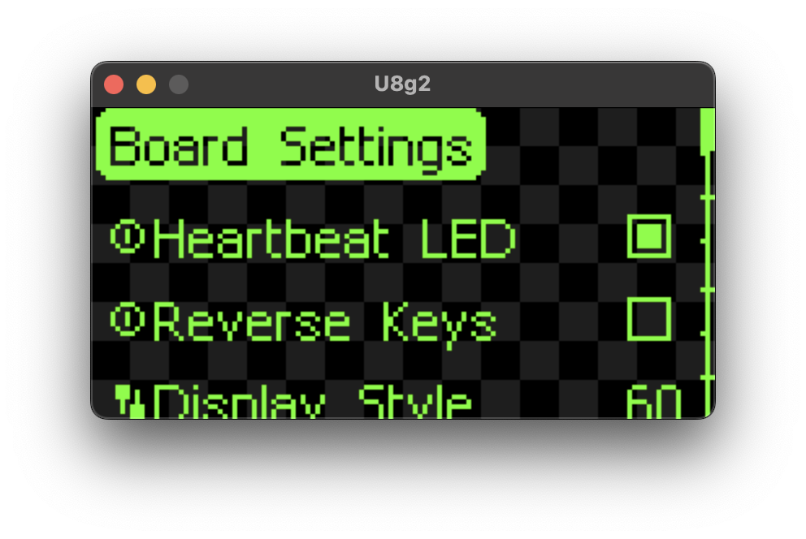

# Vision UI

Vision UI is a lightweight, list-first UI framework for monochrome/colorful displays built on top of flexible drivers.
It ships with
an SDL2-powered desktop simulator so you can prototype menus, transitions, and custom widgets before flashing firmware
to your board.

## Features

- Focused on MCU dashboards: hierarchical lists, title rows, toggles, sliders, and user-defined scenes rendered at 60
  FPS (`main.cpp`).
- Rich micro-interactions: elastic selector, scrolling text, notification bar and alert toasts, scroll bars, and exit
  masks (`include/vision/vision_ui_renderer.c`).
- Event-driven core decoupled from hardware through the `vision_ui_driver_*` interface (`include/driver/u8g2.c`), making
  it portable across OLED, LCD, and simulator targets.
- Configurable layout constants (`include/vision_ui_config.h`) for screen size, paddings, animation speeds, and widget
  measurements.
- Bundled Chinese bitmap font (`include/font/chinese.h`) and both English/Mandarin demo launchers.
- Distributed under GPL-2.0-only so it can stay aligned with the upstream u8g2 license.

## Repository Layout

- `include/vision`: UI core, renderer, item system, and C/C++ headers.
- `include/driver`: Reference driver that maps Vision UI’s drawing API to u8g2/SDL.
- `include/font`: Custom glyph sets that can be swapped at runtime.
- `components/u8g2`: Vendored u8g2 sources (no submodules required).
- `main_english.cpp`, `main_mandarin.cpp`: Simulator entry points that showcase the feature set.
- `xmake.lua`: Primary build script (CMake file is auto-generated; prefer xmake).
- `build/`, `cmake-build-debug/`: Local build artifacts (safe to delete/regenerate).

## Getting Started

### Prerequisites

| Tool                      | Purpose                | macOS install        |
|---------------------------|------------------------|----------------------|
| [xmake](https://xmake.io) | Build orchestration    | `brew install xmake` |
| SDL2 (>=2.0)              | Simulator window/input | `brew install sdl2`  |
| CMake 3.15+ (optional)    | Alternate build system | `brew install cmake` |

> On Linux, install `libsdl2-dev` via your package manager. Windows users can rely on the SDL2 binaries bundled with
> their compiler toolchain.

### Clone & configure

```bash
git clone <repo-url>
cd vision_ui
xmake f -m debug            # optional: switch between debug/release
xmake f --language=mandarin # optional: run the Mandarin demo entry
```

### Build & run the simulator

```bash
xmake                      # builds u8g2, vision_ui, and the simulator
xmake run vision_ui_simulator
```

Keyboard controls inside the simulator:

| Key   | Action                                                                  |
|-------|-------------------------------------------------------------------------|
| ↑ / ↓ | Move between list entries or adjust sliders when “locked in”.           |
| Space | Enter / confirm the selected item.                                      |
| Esc   | Exit the current layer or quit Vision UI when at the root (if enabled). |

## Embed Vision UI in Firmware

Vision UI is organized around three responsibilities: supplying a drawing backend, defining the menu tree, and running
the render loop.

### 1. Bind your display driver

If you already rely on u8g2, you can reuse `include/driver/u8g2.c` as-is. Otherwise, implement the small
`vision_ui_driver_*` surface (text metrics, primitives, buffer swaps, input) and call:

```c
vision_ui_driver_bind(&your_driver);
vision_ui_font_set(your_font_pointer);
```

### 2. Describe your UI tree

```cpp
vision_ui_core_init();

vision_ui_list_item_t* root = vision_ui_list_item_new(15, false, "VisionUI");
auto *settings = vision_ui_list_item_new(10, "Board Settings");
vision_ui_list_push_item(vision_ui_root_list_get(), settings);

vision_ui_list_push_item(
    vision_ui_root_list_get(),
    vision_ui_list_switch_item_new(1, "Switch Screen", true, [](bool enabled) {
        vision_ui_notification_push(enabled ? "Screen A" : "Screen B", 1500);
    })
);

vision_ui_list_push_item(
    settings,
    vision_ui_list_slider_item_new(1, "Display Style", 1600, 5, 1, 9999, [](int16_t value) {
        printf("Style -> %d\n", value);
    })
);

vision_ui_list_push_item(
    vision_ui_root_list_get(),
    vision_ui_list_user_item_new(1, "About…", init_fn, loop_fn, exit_fn)
);
```

`LIST_ITEM`, `SWITCH_ITEM`, `SLIDER_ITEM`, and `USER_ITEM` preserve their own state (scroll offsets, slider
confirmation, etc.). User items can take over the whole render loop to draw bespoke scenes, as demonstrated in
`main_english.cpp:test_user_item_loop_function`.

### 3. Drive the render loop

```cpp
vision_ui_render_init();

while (!vision_ui_is_exited()) {
    vision_ui_driver_buffer_clear();
    vision_ui_step_render();   // handles input, animation, widgets, and custom scenes
    vision_ui_driver_buffer_send();
}
```

Animations (selector easing, camera tracking, exit masks) are computed in `vision_ui_core.c`, so the loop stays minimal.

## Architecture Overview

- **Runtime core** (`include/vision/vision_ui_core.c`): owns the top-level loop, dispatches input events, advances the
  selector/camera animations, and decides whether to render list layers or pass control to a user-defined scene.
- **UI state & item graph** (`include/vision/vision_ui_item.c`): declares every widget struct, exposes the allocator and
  font hooks, manages the hierarchical list tree, and encapsulates notifications, alerts, selector transitions, and the
  virtual camera used for scrolling.
- **Renderer** (`include/vision/vision_ui_renderer.c`): draws list frames, sliders, switches, the icon view, selector
  chrome, alerts, notifications, and the exit/enter effects using the driver primitives.
- **Driver abstraction** (`include/vision/vision_ui_draw_driver.h`, `include/driver/*`): isolates all hardware-specific
  work (text metrics, pixel primitives, buffer swaps, key scanning) behind a narrow C API so the same core can run on
  the SDL simulator, OLED displays, or custom boards.
- **Configuration & assets** (`include/vision_ui_config.h`, `include/font/*`, `components/u8g2`): hold the tunable
  layout
  constants, font tables, and the vendored u8g2 version that Vision UI builds upon.

## Configuration & Localization

- Adjust dimensions, paddings, timing, and scroll-bar behaviors in `include/vision_ui_config.h`.

## Public API Surface

> Only the functions below are part of the supported integration surface. Everything else exposed through the headers
> is considered internal even if it links successfully.

### Core lifecycle (`vision_ui_core.h`)

- `vision_ui_render_init()`: mark the runtime as active and prime the draw driver with the current default font.
- `vision_ui_core_init()`: prepare the selector, camera, and root list after you finish building the tree.
- `vision_ui_step_render()`: run one frame — poll input, advance animations, run user items, and draw the widgets.
- `vision_ui_is_exited()`: report whether Vision UI has been closed (honors `VISION_UI_ALLOW_EXIT_BY_USER`).
- `vision_ui_is_background_frozen()`: let user code skip input handling while an alert is animating.

### UI tree & widgets (`vision_ui_item.h`)

- `vision_ui_list_item_new(capacity, icon_mode, title)`
- `vision_ui_list_title_item_new(title)`
- `vision_ui_list_icon_item_new(capacity, icon_bitmap, title, description)`
- `vision_ui_list_switch_item_new(label, default_value, on_changed_cb)`
- `vision_ui_list_slider_item_new(label, default_value, step, min, max, on_changed_cb)`
- `vision_ui_list_user_item_new(label, init_fn, loop_fn, exit_fn)`
- `vision_ui_root_item_set(root)`
- `vision_ui_list_push_item(parent, child)`

Each constructor returns a `vision_ui_list_item_t*` suitable for `vision_ui_list_push_item`. The root setter/getter pair
lets you wire up the hierarchy before calling `vision_ui_core_init()`.

### Notifications & alerts (`vision_ui_item.h`)

- `vision_ui_notification_push(content, duration_ms)`
- `vision_ui_alert_push(content, duration_ms)`

### Fonts & memory (`vision_ui_item.h`)

- `vision_ui_font_set(font_ptr)`
- `vision_ui_font_set_title(font_ptr)`
- `vision_ui_allocator_set(custom_allocator)`

### Driver interface (`vision_ui_draw_driver.h`, implement per target)

- **Binding & timing**: `vision_ui_driver_bind(driver_handle)`, `vision_ui_driver_action_get()`,
  `vision_ui_driver_ticks_ms_get()`, `vision_ui_driver_delay(ms)`.
- **Font/text control**: `vision_ui_driver_font_set(font)`, `vision_ui_driver_font_mode_set(mode)`,
  `vision_ui_driver_font_direction_set(dir)`, `vision_ui_driver_str_draw(x, y, str)`,
  `vision_ui_driver_str_utf8_draw(x, y, str)`, `vision_ui_driver_str_width_get(str)`,
  `vision_ui_driver_str_utf8_width_get(str)`, `vision_ui_driver_str_height_get()`.
- **Drawing primitives**: `vision_ui_driver_pixel_draw`, `vision_ui_driver_circle_draw`,
  `vision_ui_driver_box_draw`, `vision_ui_driver_box_r_draw`, `vision_ui_driver_frame_draw`,
  `vision_ui_driver_frame_r_draw`, `vision_ui_driver_line_draw`, `vision_ui_driver_line_h_draw`,
  `vision_ui_driver_line_v_draw`, `vision_ui_driver_line_h_dotted_draw`, `vision_ui_driver_line_v_dotted_draw`,
  `vision_ui_driver_bmp_draw`, `vision_ui_driver_color_draw`.
- **Clipping & viewport**: `vision_ui_driver_clip_window_set(x0, y0, x1, y1)`,
  `vision_ui_driver_clip_window_reset()`.
- **Buffers**: `vision_ui_driver_buffer_clear()`, `vision_ui_driver_buffer_send()`,
  `vision_ui_driver_buffer_area_send(x, y, w, h)`, `vision_ui_driver_buffer_pointer_get()`.

The driver interface is also what user items rely on when they render custom scenes, so the implementation must cover
every function in the lists above.

## Roadmap

- [x] rename the pop-up widget to alert
- [x] rename the info bar to notification
- [x] add multiple notification animation
- [x] decouple the new page, user_item, list_view
- [x] add animation for scroll bar
- [x] add icon view
- [x] use the correct format
- [x] fix the animation rate
- [x] use 2nd ODE for animation and

## License

[u8g2]: https://github.com/olikraus/u8g2
