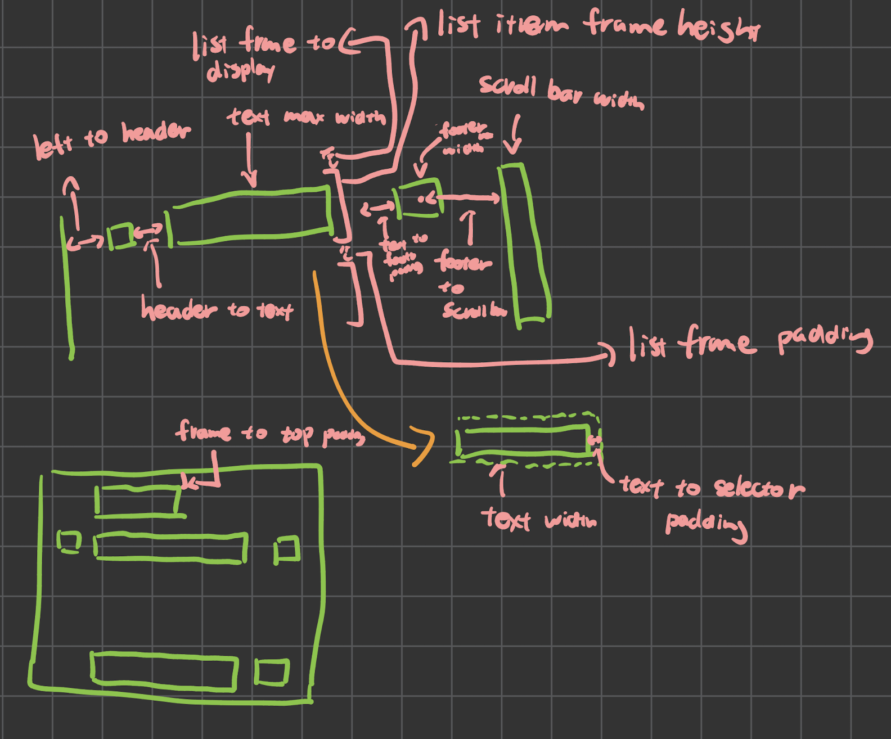

# Vision UI 配置指南

本页解释如何调节 [`include/vision_ui_config.h`](../include/vision_ui_config.h)，让你不用靠猜来理解每个宏的作用。

如果你只想先看短版结论：

- 使用编译宏，例如 `-DCONFIG_VISION_UI_SCREEN_WIDTH=128`，覆盖默认值。
- 优先从屏幕尺寸开始，再调列表行高，然后调间距。
- 除非你明确想让选择器看起来和列表框高度不同，否则让 `VISION_UI_LIST_SELECTOR_FIXED_HEIGHT` 等于
  `VISION_UI_LIST_FRAME_FIXED_HEIGHT`。
- 头文件底部标注为 `DO NOT EDIT` 的那一块应视为内部实现。

## 布局示意

下面这张草图对应配置头文件里的命名：



布局配置图：[`layout-formal.drawio`](layout-formal.drawio)

便于理解的心智模型：

- `DISPLAY`：整块屏幕。
- `FRAME`：一条列表行。
- `HEADER`：列表行左侧的小图标区域。
- `TEXT`：主要标签文本区域。
- `FOOTER`：右侧部件区域，例如开关状态或滑块值。
- `SELECTOR`：包裹当前项的动画圆角矩形。

## 如何覆盖一个值

`include/vision_ui_config.h` 会读取 `CONFIG_VISION_UI_*` 宏；如果没有提供，就回退到内置默认值。

最简单的覆盖方式是加编译宏：

```bash
cc -DCONFIG_VISION_UI_SCREEN_WIDTH=128 -DCONFIG_VISION_UI_SCREEN_HEIGHT=64 ...
```

如果你使用 xmake，可以把定义加到 target 上：

```lua
target("vision_ui")
    add_defines(
        "CONFIG_VISION_UI_SCREEN_WIDTH=128",
        "CONFIG_VISION_UI_SCREEN_HEIGHT=64",
        "CONFIG_VISION_UI_LIST_FRAME_FIXED_HEIGHT=13"
    )
```

如果你使用 CMake，可以把编译定义加到 `vision_ui` target：

```cmake
target_compile_definitions(vision_ui PUBLIC
        CONFIG_VISION_UI_SCREEN_WIDTH=128
        CONFIG_VISION_UI_SCREEN_HEIGHT=64
        CONFIG_VISION_UI_LIST_FRAME_FIXED_HEIGHT=13
)
```

为什么要加在 `vision_ui` 上，而不是只加在 `vision_ui_simulator` 上：

- 这些宏会影响库源码本身的编译结果。
- 加到 `vision_ui` 上，能保证库和任何包含它公有头文件的目标使用同样的值。
- 如果你只加在最终可执行文件上，库本身仍然可能按默认值编译。

模式始终是：

- 你定义 `CONFIG_VISION_UI_FOO`
- 库内部使用 `VISION_UI_FOO`

## 推荐调参顺序

建议按这个顺序调：

1. 屏幕尺寸
2. 列表行高与顶部间距
3. 行内左右间距
4. 文本滚动速度
5. 通知与警告
6. 图标视图布局

之所以要按这个顺序，是因为很多视觉参数只有在屏幕大小和行高稳定后才有意义。

## 屏幕与系统

这些值影响整个 UI：

| 宏                                       | 默认值   | 作用                |
|-----------------------------------------|-------|-------------------|
| `VISION_UI_SCREEN_HEIGHT`               | `240` | 屏幕高度，单位像素。        |
| `VISION_UI_SCREEN_WIDTH`                | `240` | 屏幕宽度，单位像素。        |
| `VISION_UI_ALLOW_EXIT_BY_USER`          | `0`   | 是否允许用户从顶层列表退出 UI。 |
| `VISION_UI_MAX_LIST_LAYER`              | `10`  | 列表容器的最大嵌套层数。      |
| `VISION_UI_EXIT_ANIMATION_DURATION_MS`  | `180` | 退出过渡时长。           |
| `VISION_UI_ENTER_ANIMATION_DURATION_MS` | `200` | 进入过渡时长。           |

说明：

- 先设置 `SCREEN_WIDTH` 和 `SCREEN_HEIGHT`。几乎所有布局计算都依赖它们。
- `MAX_LIST_LAYER` 是安全上限，只有在菜单树真的更深时才需要增大。
- 进入与退出时长只影响手感，不影响布局。

## 通知与警告

这些值控制叠加在当前页面上的临时提示：

| 宏                                            | 默认值    | 作用            |
|----------------------------------------------|--------|---------------|
| `VISION_UI_NOTIFICATION_HEIGHT`              | `15`   | 通知条高度。        |
| `VISION_UI_NOTIFICATION_WIDTH`               | `20`   | 通知文本左右额外留白。   |
| `VISION_UI_NOTIFICATION_DISMISS_DURATION_MS` | `1500` | 通知开始消失前停留的时长。 |
| `VISION_UI_ALERT_HEIGHT`                     | `20`   | 居中警告的高度。      |
| `VISION_UI_ALERT_WIDTH`                      | `20`   | 警告文本左右额外留白。   |

实用建议：

- 如果通知或警告文本显得拥挤，优先增大 `*_WIDTH`。
- 如果在小屏上看起来太高，优先减小 `*_HEIGHT`。
- `NOTIFICATION_DISMISS_DURATION_MS` 改的是停留时间，不是动画速度。

## 列表视图：垂直布局

这些值控制普通列表视图里各行在垂直方向上的位置：

| 宏                                             | 默认值  | 作用                |
|-----------------------------------------------|------|-------------------|
| `VISION_UI_LIST_TITLE_TO_DISPLAY_TOP_PADDING` | `0`  | 第一条标题或第一行距顶部的留白。  |
| `VISION_UI_LIST_TITLE_TO_FRAME_PADDING`       | `4`  | 标题行与下一条可选中行之间的间距。 |
| `VISION_UI_LIST_FRAME_BETWEEN_PADDING`        | `2`  | 普通列表行之间的间距。       |
| `VISION_UI_LIST_FRAME_FIXED_HEIGHT`           | `15` | 每一条列表行的高度。        |
| `VISION_UI_LIST_SELECTOR_FIXED_HEIGHT`        | `15` | 动画选择器的高度。         |
| `VISION_UI_LIST_ENTRY_ANIMATION`              | `0`  | 进入列表时各行是否执行入场动画。  |

它们的组合方式：

- 第一行从 `TITLE_TO_DISPLAY_TOP_PADDING` 开始。
- 后续每一行的位置等于“前一行 Y + LIST_FRAME_FIXED_HEIGHT + 间距”。
- 如果前一项是标题，间距取 `LIST_TITLE_TO_FRAME_PADDING`；如果前一项是普通行，取 `LIST_FRAME_BETWEEN_PADDING`。

推荐起步规则：

- 保持 `LIST_SELECTOR_FIXED_HEIGHT == LIST_FRAME_FIXED_HEIGHT`。
- 如果 UI 显得拥挤，优先增大 `LIST_FRAME_FIXED_HEIGHT`，再考虑增大行间距。
- 在矮屏幕上，优先减小顶部和行间间距，而不是先缩小文本或图标。

## 列表视图：水平布局

这些值主要对应 `layout.png` 里展示的那部分：

| 宏                                                   | 默认值  | 作用                        |
|-----------------------------------------------------|------|---------------------------|
| `VISION_UI_LIST_HEADER_TO_LEFT_DISPLAY_PADDING`     | `4`  | 屏幕左边缘到行头图标区域的距离。          |
| `VISION_UI_LIST_HEADER_MAX_WIDTH`                   | `7`  | 头部图标区域保留宽度。               |
| `VISION_UI_LIST_HEADER_MAX_HEIGHT`                  | `7`  | 头部图标区域保留高度。               |
| `VISION_UI_LIST_HEADER_TO_TEXT_PADDING`             | `2`  | 图标区域到文本区域的间距。             |
| `VISION_UI_LIST_FOOTER_MAX_WIDTH`                   | `19` | 普通列表项右侧 footer 区域的保留宽度。   |
| `VISION_UI_LIST_FOOTER_MAX_HEIGHT`                  | `11` | footer 区域保留高度。            |
| `VISION_UI_LIST_SLIDER_FOOTER_WIDTH`                | `10` | 滑块行专用的 footer 宽度。         |
| `VISION_UI_LIST_FOOTER_RIGHT_TO_SCROLL_BAR_PADDING` | `10` | footer 区域到滚动条之间的间距。       |
| `VISION_UI_LIST_FOOTER_TO_LEFT_PADDING`             | `10` | 文本区域和 footer 区域之间保留的最小间距。 |
| `VISION_UI_LIST_SELECTOR_TO_INNER_WIDGET_PADDING`   | `3`  | 选择器边框与内部内容之间的内边距。         |

屏幕上的含义：

- 左侧：`屏幕边缘 -> 左留白 -> header -> header 到文本的间距 -> text`
- 右侧：`text -> 文本到 footer 的间距 -> footer -> footer 到滚动条的间距 -> scrollbar`

文本宽度是由这些值和屏幕宽度推导出来的，不需要你直接设置文本宽度。

如果你看到具体问题，可以优先这样调整：

- Header 太贴边：增大 `VISION_UI_LIST_HEADER_TO_LEFT_DISPLAY_PADDING`
- 文本离图标太近：增大 `VISION_UI_LIST_HEADER_TO_TEXT_PADDING`
- 文本撞上右侧控件：增大 `VISION_UI_LIST_FOOTER_TO_LEFT_PADDING`
- 右侧显得太重：减小 `VISION_UI_LIST_FOOTER_MAX_WIDTH` 或 `VISION_UI_LIST_FOOTER_RIGHT_TO_SCROLL_BAR_PADDING`
- 选择器内部显得拥挤：增大 `VISION_UI_LIST_SELECTOR_TO_INNER_WIDGET_PADDING`

安全规则：

- 保持 `VISION_UI_LIST_HEADER_MAX_HEIGHT` 小于 `VISION_UI_LIST_FRAME_FIXED_HEIGHT`
- 保持 `VISION_UI_LIST_FOOTER_MAX_HEIGHT` 小于 `VISION_UI_LIST_FRAME_FIXED_HEIGHT`

## 滚动与动效

这些值用于调节列表行里的滚动行为：

| 宏                                               | 默认值    | 作用               |
|-------------------------------------------------|--------|------------------|
| `VISION_UI_LIST_TEXT_SCROLL_SPEED_PX_S`         | `15`   | 过长列表标签的水平滚动速度。   |
| `VISION_UI_LIST_TEXT_SCROLL_PAUSE_MS`           | `1000` | 文本滚动到边缘时的停顿时间。   |
| `VISION_UI_LIST_SLIDER_VALUE_SCROLL_SPEED_PX_S` | `5`    | 过长滑块数值的滚动速度。     |
| `VISION_UI_LIST_SLIDER_VALUE_SCROLL_PAUSE_MS`   | `1500` | 滑块数值滚动到边缘时的停顿时间。 |

实用建议：

- 如果长标签看起来太慢，可以提高速度。
- 如果长标签显得发抖或难以阅读，可以增加停顿时间。
- 滑块值通常适合比标题更慢的速度，因为用户更多是瞥一眼，而不是完整阅读。

## 图标视图

这些值控制另一种图标式页面布局：

| 宏                                                        | 默认值   | 作用             |
|----------------------------------------------------------|-------|----------------|
| `VISION_UI_ICON_VIEW_ITEM_SPACING`                       | `15`  | 图标之间的水平间距。     |
| `VISION_UI_ICON_VIEW_ICON_SIZE`                          | `100` | 图标盒子的像素尺寸。     |
| `VISION_UI_ICON_VIEW_ICON_TO_TOP_DISPLAY_PADDING`        | `5`   | 图标区到屏幕顶部的留白。   |
| `VISION_UI_ICON_VIEW_ICON_TO_TITLE_AREA_PADDING`         | `10`  | 图标与下方标题区之间的间距。 |
| `VISION_UI_ICON_VIEW_TITLE_AREA_HEIGHT`                  | `70`  | 标题区保留高度。       |
| `VISION_UI_ICON_VIEW_TITLE_BAR_TO_LEFT_DISPLAY_PADDING`  | `0`   | 垂直标题条左侧留白。     |
| `VISION_UI_ICON_VIEW_TITLE_BAR_WIDTH`                    | `9`   | 标题条宽度。         |
| `VISION_UI_ICON_VIEW_TITLE_BAR_TO_TITLE_PADDING`         | `10`  | 标题条到标题文本的间距。   |
| `VISION_UI_ICON_VIEW_TITLE_TO_RIGHT_DISPLAY_MIN_PADDING` | `15`  | 标题文本区域右侧最小留白。  |
| `VISION_UI_ICON_VIEW_TITLE_AREA_TO_DESCRIPTION_PADDING`  | `20`  | 标题块与描述文本之间的间距。 |
| `VISION_UI_ICON_VIEW_DESCRIPTION_AREA_HEIGHT`            | `35`  | 描述区保留高度。       |
| `VISION_UI_ICON_VIEW_DESCRIPTION_TO_DISPLAY_MIN_SPACING` | `3`   | 描述文本左右最小留白。    |
| `VISION_UI_ICON_VIEW_SCROLL_SPEED`                       | `85`  | 图标切换时的动画速度。    |

推荐做法：

- 先让 `ICON_SIZE` 适配你的屏幕。
- 再调垂直方向的间距和标题区高度。
- 最后再调描述区间距和滚动速度。

快速排查：

- 图标视图在垂直方向太挤：减小 `ICON_SIZE`、`TITLE_AREA_HEIGHT` 或 `TITLE_AREA_TO_DESCRIPTION_PADDING`
- 标题看起来太局促：增大 `TITLE_BAR_TO_TITLE_PADDING` 或 `TITLE_TO_RIGHT_DISPLAY_MIN_PADDING`
- 描述文本太贴边：增大 `DESCRIPTION_TO_DISPLAY_MIN_SPACING`

## 通常不要改的值

配置头文件末尾有一块标注为 `DO NOT EDIT`。

那部分是内部假设：

- `VISION_UI_LIST_SCROLL_BAR_WIDTH`
- `VISION_UI_LIST_SCROLL_BAR_ANIMATION_SPEED`
- `VISION_UI_LIST_TEXT_MAX_WIDTH(currentListItem)`

尤其是 `VISION_UI_LIST_TEXT_MAX_WIDTH(...)`，它是根据屏幕宽度和左右布局预留推导出来的。如果你觉得文本宽度不对，应该先修正前面的间距输入，而不是直接改这个宏。

## 示例配置

### 小尺寸 128x64 显示屏

```c
CONFIG_VISION_UI_SCREEN_WIDTH=128
CONFIG_VISION_UI_SCREEN_HEIGHT=64
CONFIG_VISION_UI_LIST_FRAME_FIXED_HEIGHT=13
CONFIG_VISION_UI_LIST_SELECTOR_FIXED_HEIGHT=13
CONFIG_VISION_UI_LIST_FOOTER_RIGHT_TO_SCROLL_BAR_PADDING=6
CONFIG_VISION_UI_LIST_FOOTER_TO_LEFT_PADDING=6
```
